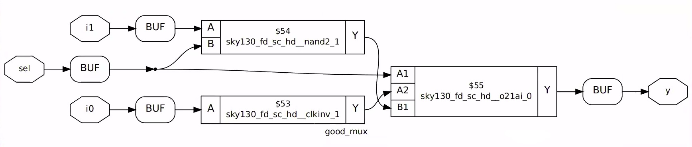

# RTL Design using Verilog with SKY130 Technology


This repository reflects the work done in the RTL Design using Verilog with SKY130 Technology workshop, offered by VLSI System Design Corp. Pvt. Ltd. It is a 5-day workshop aiming to familiarise ourselves with open source tools, PDKs, RTL Design and Synthesis. Workshop intends to teach the verilog coding guidelines that results in synthesis. The workshop also covers all the aspects of the Verilog HDL with theory and lot of practical examples. Validating the functionality of the design using Functional Simulation. Writing Test Benches to validate the functionality of the RTL design . Logic synthesis of the Functional RTL Code. Gate Level Simulation of the Synthesized Netlist.

## Table of Contents
- [About](#about)
- [DAY 1 : Introduction to Verilog RTL design and Synthesis ](#day-1--introduction-to-verilog-rtl-design-and-synthesis)
  - [Introduction to open-source simulator iverilog](#introduction-to-open-source-simulator-iverilog)
  - [Labs using iverilog and gtkwave](#labs-using-iverilog-and-gtkwave)
  - [Introduction to Yosys and Logic synthesis](#introduction-to-yosys-and-logic-synthesis)
  - [Labs using Yosys and Sky130 PDKs](#labs-using-yosys-and-sky130-pdks)

- [DAY 2: Timing libs, hierarchical vs flat synthesis and efficient flop coding styles](#day-2--timing-libs,-hierarchical-vs-flat-synthesis-and-efficient-flop-coding-styles)
  - [Introduction to timing .libs](#introduction-to-timing-.libs)
  - [Hierarchical vs Flat Synthesis](#hierarchical-vs-flat-synthesis)
  - [Various Flop Coding Styles and optimization](#various-flop-coding-styles-and-optimization)

- [DAY 3 : Combinational and sequential optmizations ](#day-3--combinational-and-sequential-optmizations)
  - [Introduction to optimizations](#introduction-to-optimizations)
  - [Combinational logic optimizations](#combinational-logic-optimizations)
  - [Sequential logic optimizations](#sequential-logic-optimizations)
  - [Sequential optimzations for unused outputs](#sequential-optimzations-for-unused-outputs)

- [DAY 4 : GLS, blocking vs non-blocking and Synthesis-Simulation mismatch ](#day-4--gls,-blocking-vs-non-blocking-and-synthesis-simulation-mismatch)
  - [GLS, Synthesis-Simulation mismatch and Blocking/Non-blocking statements](#gls,-synthesis-simulation-mismatch-and-blocking/non-blocking-statements)
  - [Labs on GLS and Synthesis-Simulation Mismatch](#labs-on-gls-and-synthesis-simulation-mismatch)
  - [Labs on synth-sim mismatch for blocking statement](#labs-on-synth-sim-mismatch-for-blocking-statement)

- [DAY 5 : Optimization in synthesis ](#day-5--optimization-in-synthesis)
  - [If Case constructs](#if-case-constructs)
  - [Labs on "Incomplete If Case"](#labs-on-"incomplete-if-case")
  - [Labs on "Incomplete overlapping Case"](#labs-on-"incomplete-overlapping-case")
  - [for loop and for generate](#for-loop-and-for-generate)
  - [Labs on "for loop" and "for generate"](#labs-on-"for-loop"-and-"for-generate")

- [Future Scope](#future-scope)
- [References](#references)
- [Acknowledgements](#acknowledgements)


## About
This workshop presents an overview of RTL design and Synthesis using Open-Source tools and Open-Source Google-Skywater 130nm node, covering concepts like optimizations, blocking vs non-blocking statements,synthesis optimization and minutue conflicts during synthesis and simulations, simulation which will result in successful synthesis, it is important to note that every verilog code is not synthesizable and even if it is , it may result in different logic depending on the coding styles used.

## DAY 1 : Introduction to Verilog RTL design and Synthesis
Register Tranfer Level is a low-level abstraction to represent a digital circuit. RTL design facilitates the designers by allowing them to design the circuit in few lines of code. It converts the functionality of a digital circuit written in Hardware Description Languages into equivalent combinational and sequential circuit. Fundamentally, Design is the actual Verilog code of set of Verilog codes which has intended functionalities to meet the specifications. While a Simulator is used to verify or check the design, Testbench is the setup to apply stimulus to the design to check its functionality.

### Introduction to open-source simulator iverilog
First step is to import all files including sky130 libraries into the system. The design flow consists of various types of files. These include:
* RTL Design - This is the verilog code for the logic which is to be implemented.
* Testbench - The testbench is code also written in verilog. The testbench instantiated the RTL design and observes its outputs for different input values to check the logic functionality of code.
* Gate level netlist - The gate level netlist contains the design in terms of individual gate connections as opposed to RTL design which is the behavioural code for the logic implemented.
[iverilog](http://iverilog.icarus.com/) is an open source verilog simulator.

### Labs using iverilog and gtkwave
Clone [this](https://github.com/kunalg123/sky130RTLDesignAndSynthesisWorkshop.git) repository in your PC.
[gtkWave](http://gtkwave.sourceforge.net/) is a wavefor simulator.
Run and test your RTL Designs already present in the github folder.


### Introduction to Yosys and Logic synthesis
Synthesizer-Yosys is the tool that helps to convert RTL to netlist. Netlist is the representation of the design in the form of standard cells (in the form of the cells present in the .lib). Design and netlist file should be one and the same. Logic synthesis is the optimiztion stage during the CAD process where the RTL code is being transformed into netlist. The standard library file is a collection of logical modules. It can include basic gates like not, and , or etc and macrocells like flops and muxes. Further many flavors of the same gate might be present like slow, medium, fast as well as multiple input options like 2 inputs , 3 inputs etc.. The synthesizer selects the best cell from the standard library based on the inputs given to it called constraints. Constraints are the designers guide to the synthesis tool on what to optimize the design for, like power, performance or area. For high performance, the tool might choose faster gates which would indeed result in high power and more area. If slower gates are used to minimize power, the performance of the design will be impacted.


### Labs using Yosys and Sky130 PDKs
Now we will synthesize a pre tested mulitiplexer design in yosys using Sky130 standard cells.





## DAY 2 : Timing libs, hierarchical vs flat synthesis and efficient flop coding styles
sky130 pdk library is used for standard cell mapping during synthesis. The design gets mapped to standard cell definitions present in "sky130_fd_sc_hd__tt_025C_1v80.lib" library. The necessary files for synthesis are well organized in the [git repository](https://github.com/kunalg123/sky130RTLDesignAndSynthesisWorkshop.git). Apart from using the standard cells from the library, it is neccessary to understand the library, their technology, temperature, and working voltage conditions. Day 2 alsi includes different types of synthesis commands and different flip flop coding styles.

### Introduction to timing .libs
The library file used is *_sky130_fd_sc_hd_tt_025C_1v80.lib_*. The nomenclature for library is not random and shows important parameters most importantly the *Process*,*Temperature* and *Voltage*. These parameters are show in the end of the name "tt_025C_1v80".  


sky130_fd_sc_hd__tt_025C_1v80.lib file also has the information about the different features of the cells. For each cell it gives the information about the leakage power, delay, area, input capacitance, power associated, timing information and etc..
As mentioned before, the library contains different flavours of same logic gates. This is done mainly to meet timing constraints.  
* *Faster cells* increases the clock frequency.
  T(clk) > T(cq_launch_flop) + T(combi) +T(setup_capture_flop)
* *Slower cells* are required to prevent hold violations.
  T(hold_capture_flop) < T(cq_launch_flop) + T(combi)
  
These different flavours are named different within the library. For example, the different flavours of and gate present are:
- Based on delay:      _sky130_fd_sc_hd_and2_0 > sky130_fd_sc_hd_and2_2 > sky130_fd_sc_hd_and2_4_
- Based on power/area: _sky130_fd_sc_hd_and2_0 < sky130_fd_sc_hd_and2_2 < sky130_fd_sc_hd_and2_4_

### Hierarchical vs Flat Synthesis
Many times in complex systems, different parts of system are designed seperately as RTL blocks(sub-modules) which can later be combined to form the whole system(top module). In such cases the synthesis can be done in two ways:
* *Hierarchial synthesis* - Here the top module is synthesised in terms of sub-modules. Only the higher level abstraction is required.
* *Flat Synthesis* - Here all sub-modules are also expanded and the top module is sysnthesised in terms of standard cells. It has lower abstraction compared to hierarchial synthesis.
Here we are considering AND gate as one module and OR gate as another module both were instantiated under multiple module.
```
  module sub_module2 (input a, input b,output);
                      Assign y=a | b;
     endmodule
module sub_module1 (input a, input b,output);
                      Assign y=a & b;
     endmodule
module multiple_module (input a, input b, input c ,output y);
                      wire net1;
                      sub_module1 u1(.a(a),.b(b),.y(net1));
                      sub_module2 u2(.a(net1),.b(c),.y(y));
     endmodule 
```

Hierarchical Synthesis                                                                       


Flat Synthesis


Without flattening heirarchies are preserved, after flattening heirarchies are not preserved
But when we do flat synthesis we can see entire structure which contains both AND and OR gates.
Why submodule level synthesis is used ?
- case 1 :  **Top module with multiple instantiations of the same component.**\
    In this case, the submodule can be just synthesized once and then later stitched together in the top module.
- case 2 : **High design complexity.**\
    Due to the size of the design, the synthesis tool is not to properly operate. In such cases we can deploy a divide and conquer strategy wherein the design can be synthesized at a submodule level and then latter stitched together in the top module.
- To synthesize a sub module use the command "synth -top" with the submodule name instead of the the top module name.

### Various Flop Coding Styles and optimization
- **Usage of FLOPS:**
In the circuit if we have more combinational circuits then outputs will become more and more glitichy, so we want an element to store that value ,that element is called as a FLOP.
Its important to control the initial states of the flops. Since the output of the flops are input to a combinational circuit, if the initial state is unknown, this may result in the combinational logic evaluating to some garbage value. To avoid this we should be able to control the initial values of the flop. For the designer, usually two ways are available. One is to reset the clock, which would set its output to 0 and the other is to set the flop which would set its output to 1. Both can be done asynchronously or synchronous with respect to the clock.

- [1] Asynchronous Reset/Set : Irrespective of clock if reset/set is one then output goes to zero/one.
         
- [2] Synchronous Reset/Set : Synchronous means, the output not set/reset as soon as the reset/set pin is asserted. Instead, it waits for the next clock edge. Synchronous set/reset are always added to the datapath, i.e. they add extra logic to the input of the flop. Even though reset is one until and unless we come across posedge of clock then only output changes.
         

Why the senthesizer is generating net list using NAND gate instead of using OR gate?
The synthesizer is inferring NAND and inverters to get OR gate because the direct cmos implementation of or gate contains stacked PMOS it has many disadvantages so we go for stacked nmos using nand gate

1. consequently normal delay of NAND is less than normal delay of NOR gate. In other words we can say that NAND gate is faster than NOR gate for same inputs.
2. For the same delay NAND gate require less area than NOR gate.
3. For the same area NAND gate is superior to NOR gates in switching characteristics because of higher mobility of electrons as compared to holes.
4. For equal fan-in, noise margin of NAND gate is better than NOR gate.

Two Optimization Problems :

_CASE 1: mult_2.v_ -- Multiply by 2: If a 3 bit number (a) is multiply by 2 then output is {a, 1b'0}.
It has a 3 bit input and generating a 4 bit output. The relationship for the output is twice the input a. Apparently, the output can be written as the input a itself appended with zeros. Ideally, there is no requirement for Hardware without needing a multiplier.
 

_CASE 2: mult_8.v_ -- Multiply by 9: If a 3 bit number a is multiply by 9 then output is {a, a}.
It has a 3 bit input and generating a 6 bit output. The relationship for the output is 9 times the input a. Apparently, the output can be written as the input a, input a itself. Ideally, there is no requirement for Hardware without needing a multiplier.
 


-----------------------------------------------------------------------------------------------------------------------------------------------------------


### Tool setup and PDK
The beauty of open-source is that it is free and available to everyone. In the whole workshop, I have used only two tools and one PDK. Ngspice is an open-source mixed-signal electronic circuit simulator used in circuit design, pre-layout, and post-layout simulation. Magic VLSI Layout Tool is an open-source circuit layout editor, used in circuit layout. Google SkyWater PDK is an open-source process design kit, used in physical design. To install these open-source tools, I would suggest you go to their websites:-
  1. [Ngspice](http://ngspice.sourceforge.net/)
  2. [Magic VLSI Layout Tool](http://opencircuitdesign.com/magic/)
  3. [Google/Skywater 130nm PDK](https://github.com/google/skywater-pdk)


