# RTL Design using Verilog with SKY130 Technology


This repository reflects the work done in the RTL Design using Verilog with SKY130 Technology workshop, offered by VLSI System Design Corp. Pvt. Ltd. It is a 5-day workshop aiming to familiarise ourselves with open source tools, PDKs, RTL Design and Synthesis. Workshop intends to teach the verilog coding guidelines that results in synthesis. The workshop also covers all the aspects of the Verilog HDL with theory and lot of practical examples. Validating the functionality of the design using Functional Simulation. Writing Test Benches to validate the functionality of the RTL design . Logic synthesis of the Functional RTL Code. Gate Level Simulation of the Synthesized Netlist.

## Table of Contents
- [About](#about)
- [DAY 1 : Introduction to Verilog RTL design and Synthesis ](#day-1--introduction-to-verilog-rtl-design-and-synthesis)
  - [Introduction to open-source simulator iverilog](#introduction-to-open-source-simulator-iverilog)
  - [Labs using iverilog and gtkwave](#labs-using-iverilog-and-gtkwave)
  - [Introduction to Yosys and Logic synthesis](#introduction-to-yosys-and-logic-synthesis)
  - [Labs using Yosys and Sky130 PDKs](#labs-using-yosys-and-sky130-pdks)

- [DAY 2: Timing libs, hierarchical vs flat synthesis and efficient flop coding styles](#day-2--timing-libs,-hierarchical-vs-flat-synthesis-and-efficient-flop-coding-styles)
  - [Introduction to timing .libs](#introduction-to-timing-.libs)
  - [Hierarchical vs Flat Synthesis](#hierarchical-vs-flat-synthesis)
  - [Various Flop Coding Styles and optimization](#various-flop-coding-styles-and-optimization)

- [DAY 3 : Combinational and sequential optmizations ](#day-3--combinational-and-sequential-optmizations)
  - [Introduction to optimizations](#introduction-to-optimizations)
  - [Combinational logic optimizations](#combinational-logic-optimizations)
  - [Sequential logic optimizations](#sequential-logic-optimizations)
  - [Sequential optimzations for unused outputs](#sequential-optimzations-for-unused-outputs)

- [DAY 4 : GLS, blocking vs non-blocking and Synthesis-Simulation mismatch ](#day-4--gls,-blocking-vs-non-blocking-and-synthesis-simulation-mismatch)
  - [GLS, Synthesis-Simulation mismatch and Blocking/Non-blocking statements](#gls,-synthesis-simulation-mismatch-and-blocking/non-blocking-statements)
  - [Labs on GLS and Synthesis-Simulation Mismatch](#labs-on-gls-and-synthesis-simulation-mismatch)
  - [Labs on synth-sim mismatch for blocking statement](#labs-on-synth-sim-mismatch-for-blocking-statement)

- [DAY 5 : Optimization in synthesis ](#day-5--optimization-in-synthesis)
  - [If Case constructs](#if-case-constructs)
  - [Labs on "Incomplete If Case"](#labs-on-"incomplete-if-case")
  - [Labs on "Incomplete overlapping Case"](#labs-on-"incomplete-overlapping-case")
  - [for loop and for generate](#for-loop-and-for-generate)
  - [Labs on "for loop" and "for generate"](#labs-on-"for-loop"-and-"for-generate")

- [Future Scope](#future-scope)
- [References](#references)
- [Acknowledgements](#acknowledgements)


## About
This workshop presents an overview of RTL design and Synthesis using Open-Source tools and Open-Source Google-Skywater 130nm node, covering concepts like optimizations, blocking vs non-blocking statements,synthesis optimization and minutue conflicts during synthesis and simulations, simulation which will result in successful synthesis, it is important to note that every verilog code is not synthesizable and even if it is , it may result in different logic depending on the coding styles used.

## DAY 1 : Introduction to Verilog RTL design and Synthesis
Register Tranfer Level is a low-level abstraction to represent a digital circuit. RTL design facilitates the designers by allowing them to design the circuit in few lines of code. It converts the functionality of a digital circuit written in Hardware Description Languages into equivalent combinational and sequential circuit. Fundamentally, Design is the actual Verilog code of set of Verilog codes which has intended functionalities to meet the specifications. While a Simulator is used to verify or check the design, Testbench is the setup to apply stimulus to the design to check its functionality.

### Introduction to open-source simulator iverilog
First step is to import all files including sky130 libraries into the system. The design flow consists of various types of files. These include:
* RTL Design - This is the verilog code for the logic which is to be implemented.
* Testbench - The testbench is code also written in verilog. The testbench instantiated the RTL design and observes its outputs for different input values to check the logic functionality of code.
* Gate level netlist - The gate level netlist contains the design in terms of individual gate connections as opposed to RTL design which is the behavioural code for the logic implemented.
[iverilog](http://iverilog.icarus.com/) is an open source verilog simulator.

### Labs using iverilog and gtkwave
Clone [this](https://github.com/kunalg123/sky130RTLDesignAndSynthesisWorkshop.git) repository in your PC.\
[gtkWave](http://gtkwave.sourceforge.net/) is a wavefor simulator.
Run and test your RTL Designs already present in the github folder.


### Introduction to Yosys and Logic synthesis
Synthesizer-Yosys is the tool that helps to convert RTL to netlist. Netlist is the representation of the design in the form of standard cells (in the form of the cells present in the .lib). Design and netlist file should be one and the same. Logic synthesis is the optimiztion stage during the CAD process where the RTL code is being transformed into netlist. The standard library file is a collection of logical modules. It can include basic gates like not, and , or etc and macrocells like flops and muxes. Further many flavors of the same gate might be present like slow, medium, fast as well as multiple input options like 2 inputs , 3 inputs etc.. The synthesizer selects the best cell from the standard library based on the inputs given to it called constraints. Constraints are the designers guide to the synthesis tool on what to optimize the design for, like power, performance or area. For high performance, the tool might choose faster gates which would indeed result in high power and more area. If slower gates are used to minimize power, the performance of the design will be impacted.


### Labs using Yosys and Sky130 PDKs
Now we will synthesize a pre tested mulitiplexer design in yosys using Sky130 standard cells.


## DAY 2 : Timing libs, hierarchical vs flat synthesis and efficient flop coding styles
sky130 pdk library is used for standard cell mapping during synthesis. The design gets mapped to standard cell definitions present in "sky130_fd_sc_hd__tt_025C_1v80.lib" library. The necessary files for synthesis are well organized in the [git repository](https://github.com/kunalg123/sky130RTLDesignAndSynthesisWorkshop.git). Apart from using the standard cells from the library, it is neccessary to understand the library, their technology, temperature, and working voltage conditions. Day 2 alsi includes different types of synthesis commands and different flip flop coding styles.

### Introduction to timing .libs
The library file used is *_sky130_fd_sc_hd_tt_025C_1v80.lib_*. The nomenclature for library is not random and shows important parameters most importantly the *Process*,*Temperature* and *Voltage*. These parameters are show in the end of the name "tt_025C_1v80".  


sky130_fd_sc_hd__tt_025C_1v80.lib file also has the information about the different features of the cells. For each cell it gives the information about the leakage power, delay, area, input capacitance, power associated, timing information and etc..
As mentioned before, the library contains different flavours of same logic gates. This is done mainly to meet timing constraints.  
* *Faster cells* increases the clock frequency.
  T(clk) > T(cq_launch_flop) + T(combi) +T(setup_capture_flop)
* *Slower cells* are required to prevent hold violations.
  T(hold_capture_flop) < T(cq_launch_flop) + T(combi)
  
These different flavours are named different within the library. For example, the different flavours of and gate present are:
- Based on delay:      _sky130_fd_sc_hd_and2_0 > sky130_fd_sc_hd_and2_2 > sky130_fd_sc_hd_and2_4_
- Based on power/area: _sky130_fd_sc_hd_and2_0 < sky130_fd_sc_hd_and2_2 < sky130_fd_sc_hd_and2_4_

### Hierarchical vs Flat Synthesis
Many times in complex systems, different parts of system are designed seperately as RTL blocks(sub-modules) which can later be combined to form the whole system(top module). In such cases the synthesis can be done in two ways:
* *Hierarchial synthesis* - Here the top module is synthesised in terms of sub-modules. Only the higher level abstraction is required.
* *Flat Synthesis* - Here all sub-modules are also expanded and the top module is sysnthesised in terms of standard cells. It has lower abstraction compared to hierarchial synthesis.
Here we are considering AND gate as one module and OR gate as another module both were instantiated under multiple module.
```
  module sub_module2 (input a, input b,output);
                      Assign y=a | b;
     endmodule
module sub_module1 (input a, input b,output);
                      Assign y=a & b;
     endmodule
module multiple_module (input a, input b, input c ,output y);
                      wire net1;
                      sub_module1 u1(.a(a),.b(b),.y(net1));
                      sub_module2 u2(.a(net1),.b(c),.y(y));
     endmodule 
```

Hierarchical Synthesis                                             

Flat Synthesis


Without flattening heirarchies are preserved, after flattening heirarchies are not preserved
But when we do flat synthesis we can see entire structure which contains both AND and OR gates.
Why submodule level synthesis is used ?
- case 1 :  **Top module with multiple instantiations of the same component.**\
    In this case, the submodule can be just synthesized once and then later stitched together in the top module.
- case 2 : **High design complexity.**\
    Due to the size of the design, the synthesis tool is not to properly operate. In such cases we can deploy a divide and conquer strategy wherein the design can be synthesized at a submodule level and then latter stitched together in the top module.
- To synthesize a sub module use the command "synth -top" with the submodule name instead of the the top module name.

### Various Flop Coding Styles and optimization
- **Usage of FLOPS:**
In the circuit if we have more combinational circuits then outputs will become more and more glitichy, so we want an element to store that value ,that element is called as a FLOP.
Its important to control the initial states of the flops. Since the output of the flops are input to a combinational circuit, if the initial state is unknown, this may result in the combinational logic evaluating to some garbage value. To avoid this we should be able to control the initial values of the flop. For the designer, usually two ways are available. One is to reset the clock, which would set its output to 0 and the other is to set the flop which would set its output to 1. Both can be done asynchronously or synchronous with respect to the clock.

- [1] Asynchronous Reset/Set : Irrespective of clock if reset/set is one then output goes to zero/one.

- [2] Synchronous Reset/Set : Synchronous means, the output not set/reset as soon as the reset/set pin is asserted. Instead, it waits for the next clock edge. Synchronous set/reset are always added to the datapath, i.e. they add extra logic to the input of the flop. Even though reset is one until and unless we come across posedge of clock then only output changes.


Why the senthesizer is generating net list using NAND gate instead of using OR gate?
The synthesizer is inferring NAND and inverters to get OR gate because the direct cmos implementation of or gate contains stacked PMOS it has many disadvantages so we go for stacked nmos using nand gate

1. consequently normal delay of NAND is less than normal delay of NOR gate. In other words we can say that NAND gate is faster than NOR gate for same inputs.
2. For the same delay NAND gate require less area than NOR gate.
3. For the same area NAND gate is superior to NOR gates in switching characteristics because of higher mobility of electrons as compared to holes.
4. For equal fan-in, noise margin of NAND gate is better than NOR gate.

Two Optimization Problems :

_CASE 1: mult_2.v_ -- Multiply by 2: If a 3 bit number (a) is multiply by 2 then output is {a, 1b'0}.
It has a 3 bit input and generating a 4 bit output. The relationship for the output is twice the input a. Apparently, the output can be written as the input a itself appended with zeros. Ideally, there is no requirement for Hardware without needing a multiplier.

 

_CASE 2: mult_8.v_ -- Multiply by 9: If a 3 bit number a is multiply by 9 then output is {a, a}.
It has a 3 bit input and generating a 6 bit output. The relationship for the output is 9 times the input a. Apparently, the output can be written as the input a, input a itself. Ideally, there is no requirement for Hardware without needing a multiplier.

 

## DAY 3 : Combinational and sequential optmizations
The synthesis tool comes with many features. One of such features which has a huge impact on design is _optimisation_. The tool does optimisation on the RTL design. Usually these optimisation are done to obtain least hardware and input voltage and omit unwanted components.

### Introduction to optimizations
The synthesis tool can adopt various techniques to the most optimized design for power, area or performance. There is two broad ways in which tool try to optimize the design i.e. Combinational logic optimizations and Sequential logic optimizations

### Combinational logic optimizations
Some of the common techniques used for optimizing combinational logic are constant propagation and boolean logic optimization. These are covered in detail below.
* Constant Propagation
  In this technique, constant inputs to the logic are propagate to the output which results in a minimized expression implementing the same logic. For example consider the case y=((ab)+c)' when b is tied to 0.
   
  We can see that the whole expression can be reduced to just an inverter. The input a does not affect the input as well.

* Boolean logic optimization
  This is the good old techniques of minimizing large boolean expression using laws of boolean algebra. Consider the below expression for an example.
  ```
  assign y=a?(b?c:(c?a:0)):(!c)
  ```
  If we write the expanded form, it would look something like below
  ```
  y = a(bc + b'(ca + c'0)) + a'c'
  = abc + ab'c + a'c'
  = ac(b+b') + a'c'
  = ac = a'c'
  = a xnor c
  ```
  We can see that the long expression got minimized to a single xnor gate. \


```
module opt_check2 (input a , input b , output y);
  assign y = a?1:b;
endmodule
```
The optimized graphical realization thus shows 2-input OR gate being implemented. Although OR gate can be realized using NOR, it can lead to having stacked PMOS configuration which is not a design recommendation. So the OR gate is realized using NAND and NOT gates (which has stacked NMOS configuration).
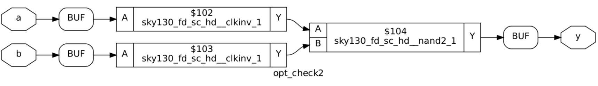  \

```
module opt_check3 (input a , input b, input c , output y);
  assign y = a?(c?b:0):0;
endmodule
```
The optimized graphical realization thus shows 3-input AND gate being implemented.
  \


```
module opt_check4 (input a , input b , input c , output y);
  assign y = a?(b?(a & c ):c):(!c);
endmodule
```
The optimized graphical realization thus shows A XNOR C gate being implemented.
  \


```
module sub_module1(input a , input b , output y);
 assign y = a & b;
endmodule


module sub_module2(input a , input b , output y);
 assign y = a^b;
endmodule


module multiple_module_opt(input a , input b , input c , input d , output y);
wire n1,n2,n3;

sub_module1 U1 (.a(a) , .b(1'b1) , .y(n1));
sub_module2 U2 (.a(n1), .b(1'b0) , .y(n2));
sub_module2 U3 (.a(b), .b(d) , .y(n3));

assign y = c | (b & n1); 

endmodule
```
Flatten the module before linking with standard cells. The optimized graphical realization thus shows a 2-input AND into first input of 2-input OR gate being implemented.
  \
  
### Sequential logic optimizations
Some of the common techniques used for optimizing sequential logic are :
* Sequential constant propagation
  To understand sequential constant propagation, check out the below verilog code.
  ```
  module dff_prop(clk,d,q,rst);
    input clk,rst,d;
    output reg q;

    always @(posedge clk or posedge rst)
      begin
        if(rst)
          q<=1'b0;
        else
          q<=1'b0;
      end
  endmodule
  ```
  If you look carefully, we can see that the output q would always be 0, irrespective of clk,d or reset. ie the flop can be optimized away. Lets see what yosys thinks.
   
  We can see that the entire circuit gets optimized to just a single wire. This is sequential constant propagation.
* Cases when Sequential constant propagation do not apply
  A constant connected to the input of a flop does not mean that we can always optimize it out. To understand better, see the code below.
  ```
  module dff_no_prop(clk,d,q,set);
    input clk,set,d;
    output reg q;

    always @(posedge clk or posedge set)
      begin
        if(set)
          q<=1'b1;
        else
          q<=1'b0;
      end
  endmodule
  ```
  We might be compelled to think that we can optimize out the flop. The output seems like following the set pin. ie when set is asserted the output is high and when its is de asserted its low. In other words, q<=set. lets look at the timing diagram once.
     \
  We can clearly see that the flop cannot be optimized out in this case.  \
     \
  Yosys also thinks the same and is retaining the flop after synthesis. The point is **not all constant input flops can be optimized out**.  \

There are also advanced techniques to obtain a most condensed state machine: 
- [1] State Optimization where the unused states are being optimized. 
- [2] Cloning way of logic is done during physical aware synthesis (where if two flops are sitting far off - there might be a large routing delay. To prevent this, a flip flop with huge positive slack can be cloned and the timing can be met). 
- [3] Re-timing - the combinational logic is partitioned effectively to reduce the delay, thereby increasing the frequency of operation. Hence, the performance of the circuit is improved using this technique.   \

```
module dff_const1(input clk, input reset, output reg q);
always @(posedge clk, posedge reset)
begin
  if(reset)
    q <= 1'b0;
  else
    q <= 1'b1;
end
endmodule
```
   \

```
module dff_const2(input clk, input reset, output reg q);
always @(posedge clk, posedge reset)
begin
  if(reset)
    q <= 1'b1;
  else
    q <= 1'b1;
end
endmodule
```
   \

```
module dff_const3(input clk, input reset, output reg q);
reg q1;
always @(posedge clk, posedge reset)
begin
  if(reset)
  begin
    q <= 1'b1;
    q1 <= 1'b0;
  end
  else
  begin
    q1 <= 1'b1;
    q <= q1;
  end
end
endmodule
```
   \

```
module dff_const4(input clk, input reset, output reg q);
reg q1;
always @(posedge clk, posedge reset)
begin
  if(reset)
  begin
    q <= 1'b1;
    q1 <= 1'b1;
  end
  else
  begin
    q1 <= 1'b1;
    q <= q1;
  end
end
endmodule
```
   \

```
module dff_const5(input clk, input reset, output reg q);
reg q1;
always @(posedge clk, posedge reset)
begin
  if(reset)
  begin
    q <= 1'b0;
    q1 <= 1'b0;
  end
  else
  begin
    q1 <= 1'b1;
    q <= q1;
  end
end
endmodule
```
   \

### Sequential optimzations for unused outputs
In some cases all the outputs of the logic are not used, the synthesizer tries to optimize such kind of logic. Consider an example of 3-Bit up-conter.
```
module counter_opt (input clk , input reset , output q);
reg [2:0] count;
assign q = count[0];
always @(posedge clk ,posedge reset)
begin
  if(reset)
    count <= 3'b000;
  else
    count <= count + 1;
end
endmodule
```
At first glance, we might think that the design would contain 3 flops after synthesis. After all the counter is a 3 bit one. If we look closely, we find that q<=count[0]. So we just need one flop that toggles count[0] every clock cycle. Also the reset would be connected to the set of an async set flop. Lets see what yosys thinks.


We can clearly see that yosys has inferred just a single flop and the entire circuit is exactly like what we imagined it to be. Long story short, **any logic that does not affect the primary outputs will be optimized out.**

## DAY 4 : GLS, blocking vs non-blocking and Synthesis-Simulation mismatch
Previously, the functionality of the design was given stimulus inputs and the output was verified to meet the specifications through a test bench module. The RTL design was considered as the DUT (Design Under Test). In Gate Level Simulation (GLS), the Netlist is considered as the Design Under Test.  Netlist is logically same as the RTL code that was converted to Standard Cell Gates. Hence, same test bench will align with the design. 

### GLS, Synthesis-Simulation mismatch and Blocking/Non-blocking statements
GLS is required to check the correctness of the design after synthesis. After all the netlist is produced by an automated algorithm which can easily go wrong. So its imperative that we compare and test the resultant netlist against the original specification and make sure that its indeed the same. It can also be used to check whether the design meets the timing constraints. For this the gate level models of the standard cell libraries should be delay annotated. \
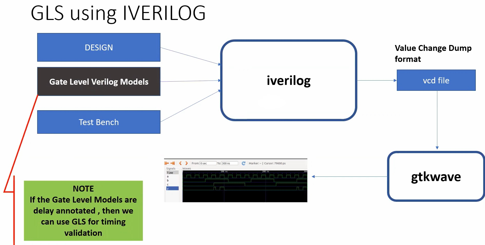

Situations may arise when the rtl simulation and the gate level simulation yields different results. This clearly indicates that the netlist after synthesis might not match with the requirements in hand. This is called synthesis simulation mismatch. In this section, we look into details some common reason for simulation synthesis mismatches.There may be synthesis and simulation mismatch due to the following reasons: \

1. **Missing signals in sensitivity list** : This issue is mainly due to how the simulator works. An always block is executed only when any of the signals in its sensitivity list changes. So for any logic, all the value that are read by that block should be in the sensitivity list. If some of them is missed, then the block may not be run for changes to that signals. But since the logic written inside the block might itself be correct, the synthesis tool might infer the correct logic. This would then lead to a mismatch between the rtl and gls simulation. \

Simulator works based on ACTIVITY that means if there is change in input then only there is a change in the output
//**eg-2 by 1 mux**:
```
  module mux(
input i0,input i1
input sel,
output reg y
);
always @ (sel)
begin
   if (sel)
            y = i1;
   else 
            y = i0;
            
end
endmodule
```
//
- **here always block is getting evaluated only when the select is changing even though there is changes in i0 and i1**
- always block is not sensitive to changes in the i1 this is what we called as **missing element in the sensitivity list**
- so to overcome that we must use always(*) 
- therefore the output changes for any of the input changes its code is given as below    \

2. **Blocking Vs Non Blocking Assignments** : Both blocking and nonblocking statements are procedural statements that can only come inside an always( or initial ) block. The main difference between them is that blocking statements are evaluated in the order they are written while all non blocking statements execute concurrently. These difference can cause synthesis simulation mismatches due to the order in which the blocking statements are written. **As a rule of thumb always use blocking statements for combinational logic and non blocking statements for sequential logic**    \

- **eg:shift register using blocking assignments**
```
 module code (input clk,input reset,
input d,
output reg q);
always @ (posedge clk,posedge reset)
begin
if(reset)
begin
        q0 = 1'b0;
        q = 1'b0;
end
else
        q = q0;
        q0 = d;
        
end
endmodule  
```
- In this case q0 is assigned to q and then d gets assigned to q0.So we get 2 values,so it will have 2 flops in the netlist.
- **eg:**
```
  module code (input clk,input reset,
input d,
output reg q);
always @ (posedge clk,posedge reset)
begin
if(reset)
begin
        q0 = 1'b0;
        q = 1'b0;
end
else
        q0 = d;
        q = q0;
                
end
endmodule 
```

- In this case q0 is assigned d the q0 gets assigned to q ,So it is as if q is getting the value of d which means it only has 1 flop
### eg:shift register using non blocking assignments
```
module code (input clk,input reset,
input d,
output reg q);
always @ (posedge clk,posedge reset)
begin
if(reset)
begin
        q0 <= 1'b0;
        q <= 1'b0;
end
else
        q0 <= d;
        q <= q0;
                
end
endmodule
```

- In the non-blocking assignments the order doesnt matter,therefore irrespective of order we will get two flops over here.    \

3. **Non Standard Verilog Coding** : You know it right.

### Labs on GLS and Synthesis-Simulation Mismatch
CASE 1: ternary_operator.v    \
```
module ternary_operator_mux (input i0 , input i1 , input sel , output y);
  assign y = sel?i1:i0;
endmodule
```

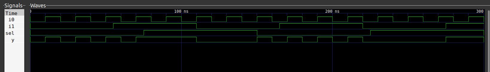
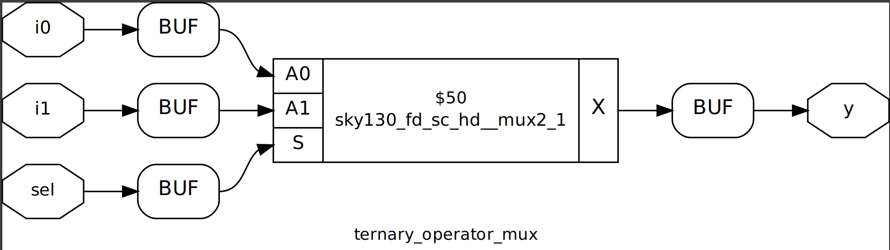  

GLS Output    \
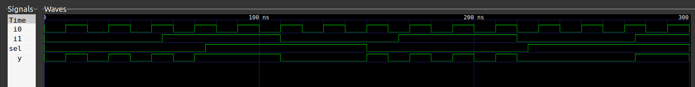 

CASE 2: bad_mux.v showing mismatch due to missing sensitivity list
```
module bad_mux (input i0 , input i1 , input sel , output reg y);
always @ (sel)
begin
  if(sel)
    y <= i1;
  else 
    y <= i0;
end
endmodule
```
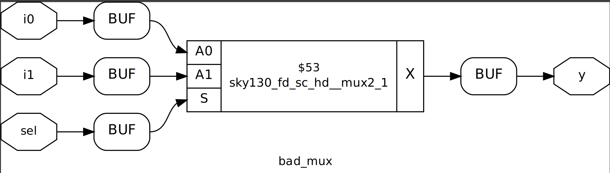
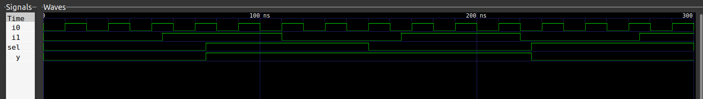 
When select is low, it follows i0, and there is no activity happening in select line - so the output remains low. When the select is high, it follows i1, and again there is no activiting in the select line. Thus it acts as a flop, retaining its value.

GLS Output    \
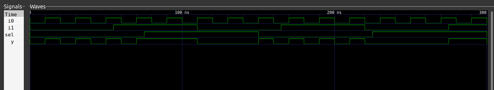
Confirms the functionality of 2x1 mux after synthesis where when the select is low, activity of input 0 is reflected on y. Similarly, when the select is hight, activity of input 1 is reflected on y. Hence there is a synthesis simulation mismatch due to missing sensitivity list.  

### Labs on synth-sim mismatch for blocking statement
CASE 1: blocking_caveat.v showing mismatch due to blocking assignments
```
module blocking_caveat (input a , input b , input  c, output reg d); 
reg x;
always @ (*)
begin
  d = x & c;
  x = a | b;
end
endmodule
```
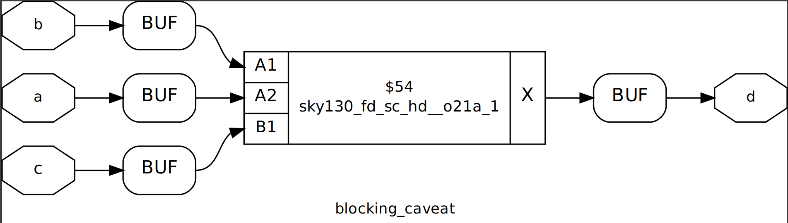
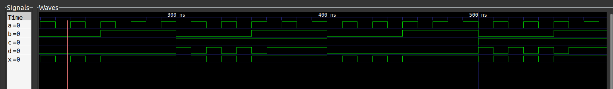

d = (a+b).c, if the inputs a,b = 0; then a+b = 0. The output d = 0. But, we observe the output d = 1 because it looks at the past value where a+b was 1.

GLS Output    \
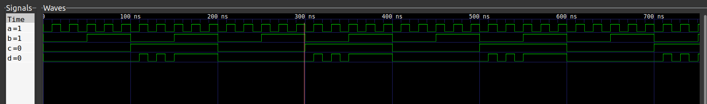

The value of output d is 0 after simulation and 1 after synthesis for the same set of input values. Hence there is a synthesis simulation mismatch due to blocking assignments.


## DAY 5 : Optimization in synthesis
Manytimes diffrent coding styles leads to different synthesis hardware for the same behavioral codes. Its important to proprly complete the conditional statements in the design to avoid the synthesis simulation mismatches.

### If Case constructs
The if statement is a conditional statement which uses boolean conditions to determine which blocks of verilog code to execute. If always translates into Multiplexer. It is used for priority Logic and are always used inside always block.The variable should be assigned as a register. \
**_Inferred latches_** can serve as a 'warning sign' that the logic design might not be implemented as intended. They represent a bad coding style, which happens because of incomplete if statements/crucial statements missing in the design. For ex: if a else statement is missing in the logic code, the hardware has not been informed on the decision, and hence it will _latch_ and will tried retain the value. This type of design should be completely avoided unless intended to meet the design functionality (ex: Counter Design). Combinational circuits cannot have an inferred latch. \

In Case statement, the hardware implementation is a Multiplexer. Similar to IF Statements, Case statements are also used inside always block and the variable should be a register variable. \

**Caveats in CASE Statements**  \

1. Case statements are dangerous when there is an incomplete Case Statement Structure may lead to inferred latches. To avoid inferred latches, code Case with default conditions. When the conditions are not met, the code executes default condition.

```
reg y
always @ (*)
begin
  case(sel)
    2'b00:begin
          ....
          end
    2'b01:begin
          ....
          end
          .
          .
  default:begin
         ....
           end
  endcase 
end
```

2. Partial Assignments in Case statements - not specifying the values. This will also create inferred latches. To avoid inferred latches, assign all the inputs in all the segments of the case statement. 

### Labs on "Incomplete If Case"
**CASE 1: incomplete if statements**
```
module incomp_if (input i0 , input i1 , input i2 , output reg y);
always @ (*)
begin
  if(i0)
    y <= i1;
end
endmodule
```
Else case is missing so there will be a D latch.  \
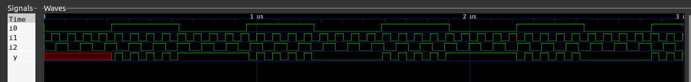 
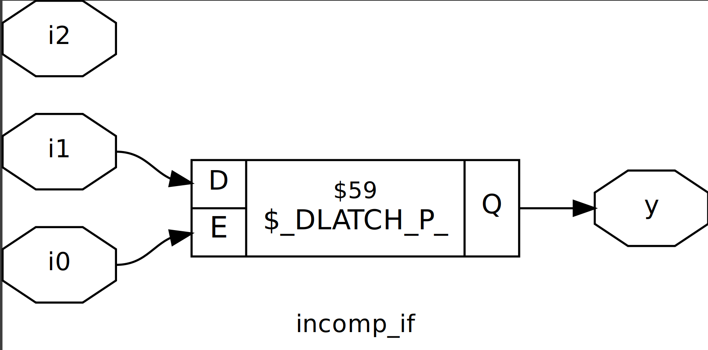 

When i0 (select line) is low, the output latches to a constant value. Presence of inferred latches due to incomplete if structure. The synthesized design has a D Latch inferred due to incomplete if structure (missing else statement).  \

**CASE 2: incomplete if statements**
```
module incomp_if2 (input i0 , input i1 , input i2 , input i3, output reg y);
always @ (*)
begin
  if(i0)
    y <= i1;
  else if (i2)
    y <= i3;

end
endmodule
```
Else case is missing so there will be a latch.
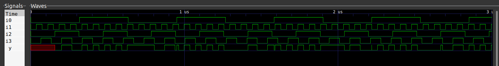 
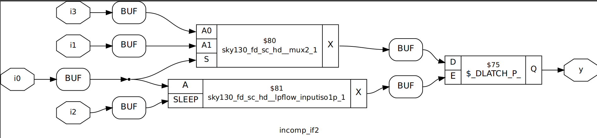

When i0 is high, the output follows i1. When i0 is low, the output latches to a constant value (when both i0 and i2 are 0). Presence of inferred latches due to incomplete if structure. The synthesized design has a D Latch inferred due to incomplete if structure (missing else statement).  \

**CASE 3: incomplete case statements**
```
module incomp_case (input i0 , input i1 , input i2 , input [1:0] sel, output reg y);
always @ (*)
begin
  case(sel)
    2'b00 : y = i0;
    2'b01 : y = i1;
  endcase
end
endmodule
```                
There is an incomplete case structure, so a latch is expected.

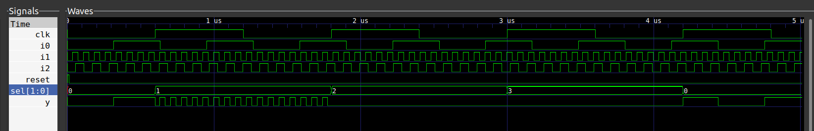 
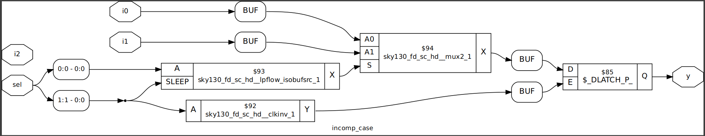

When select signal is 00, the output follows i0 and is i1 when the select value is 01. Since the output is undefined for 10 and 11 values, the ouput latches to the previously available value. The synthesized design has a D Latch inferred due to incomplete case structure (missing output definition for 2 of the select statements).         \

**CASE 4: incomplete case statements with default**
```
module comp_case (input i0 , input i1 , input i2 , input [1:0] sel, output reg y);
always @ (*)
begin
  case(sel)
    2'b00 : y = i0;
    2'b01 : y = i1;
    default : y = i2;
  endcase
end
endmodule
```   
There is an incomplete case structure but with a default condition, so a latch is not expected.

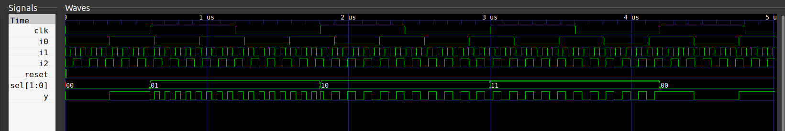 
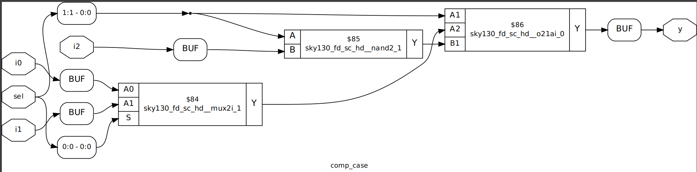

When select signal is 00, the output follows i0 and is i1 when the select value is 01. Since the output is undefined for 10 and 11 values, the presence of default sets the output to i2 when the select line is 10 or 11. The ouput will not latch and be a proper combinational circuit. The synthesized design has combinational logic without latch due to the presence of default case statement.  \

### Labs on "Incomplete overlapping Case"

**CASE 1: partial case statement**
```
module partial_case_assign (input i0 , input i1 , input i2 , input [1:0] sel, output reg y , output reg x);
always @ (*)
begin
  case(sel)
    2'b00 : begin
      y = i0;
      x = i2;
      end
    2'b01 : y = i1;
    default : begin
               x = i1;
         y = i2;
        end
  endcase
end
endmodule
```  
The mux for output y will not have a latch, while there will be a latch for mux with output x as one of the conditions is not defined.

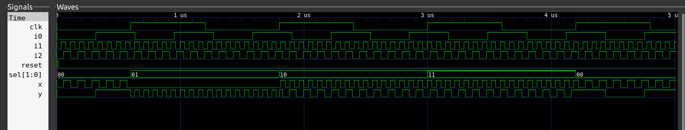 
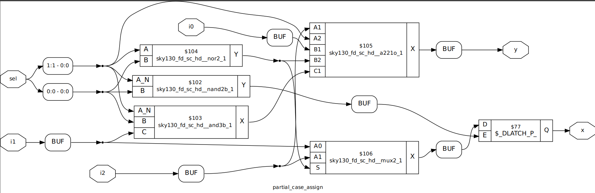

The synthesized design has a latch due to partial case statement for output x. Though we write default condition, there can be inferred latches.  \

**CASE 2: overlapping case statement**
```
module bad_case (input i0 , input i1, input i2, input i3 , input [1:0] sel, output reg y);
always @(*)
begin
  case(sel)
    2'b00: y = i0;
    2'b01: y = i1;
    2'b10: y = i2;
    2'b1?: y = i3;
    //2'b11: y = i3;
  endcase
end
endmodule
```
Although the case structure is not complete, there is overlapping of output when the select input is 10 or 11 and ? represented that the bit can be wither 0 or 1. Thus, the simulator may be confused.

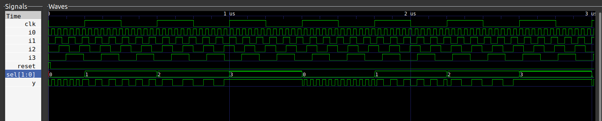 

Here, when the select input is 11, the output value is latched to a value.  \

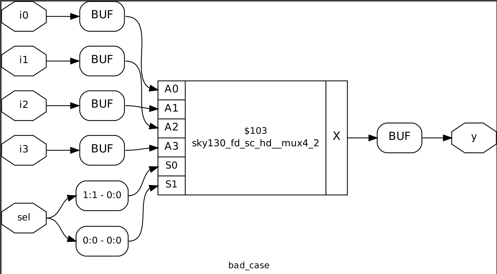 

It can be inferred that there is no Latch in the synthesized netlist as the case structure is complete (no presence of inferred latches).  \

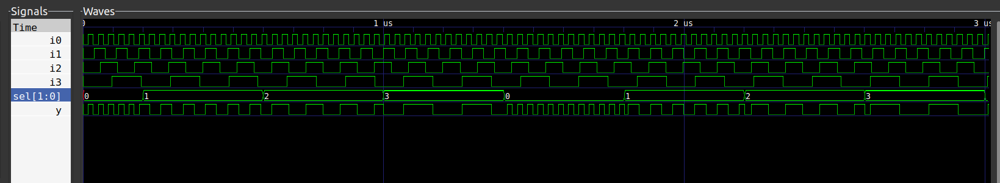

There is no latch observed in the output. The synthesizer tool does not get confused. Hence there is a Synthesis Simulation Mismatch due to overlapping of legs in the code. Care must be taken to address the legs individually without any overlap (mutually exlusive code)   \

### for loop and for generate
**For loop** are used inside procedural blocks. They are used to evaluate expressions. They are not for instantiating modules.
The following code uses for loop to generate a 4X1 mux.
```
module mux_generate (input i0 , input i1, input i2 , input i3 , input [1:0] sel  , output reg y);
  wire [3:0] i_int;
  assign i_int = {i3,i2,i1,i0};
  integer k;
  always @ (*)
    begin
    for(k = 0; k < 4; k=k+1) begin
      if(k == sel)
       y = i_int[k];
      end
    end
endmodule
```
The main advantage of such a coding style is scalability. To convert this code to generate 128X1 mux would just mean, changing the loop condition( and of course the inputs and select also should be scaled accordingly).   \
**For Generate** loops are used to multiple instantiations of modules. They are not to be used inside a procedural block. An example is shown below.
```
module and_8(a,b,y);
  input [7:0] a,b;
  output [7:0] y;
  genvar i;
  generate
    for(i=0;i<8;i=i+1)
      and g(y[i],a[i],b[i]);
    endgenerate
    endmodule
```
The above will instantiate 8 and gates and make connections accordingly. Much more scalable than writing all the individual instantiations separately.

### Labs on "for loop" and "for generate"

**CASE 1: using generate if statement**
```
module mux_generate (input i0 , input i1, input i2 , input i3 , input [1:0] sel  , output reg y);
wire [3:0] i_int;
assign i_int = {i3,i2,i1,i0};
integer k;
always @ (*)
begin
for(k = 0; k < 4; k=k+1) begin
  if(k == sel)
    y = i_int[k];
end
end
endmodule
```
The structure is complete and expected to behave as a 4x1 multiplexer.

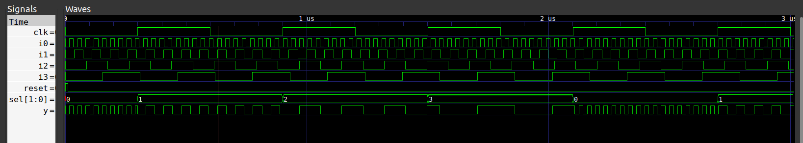 
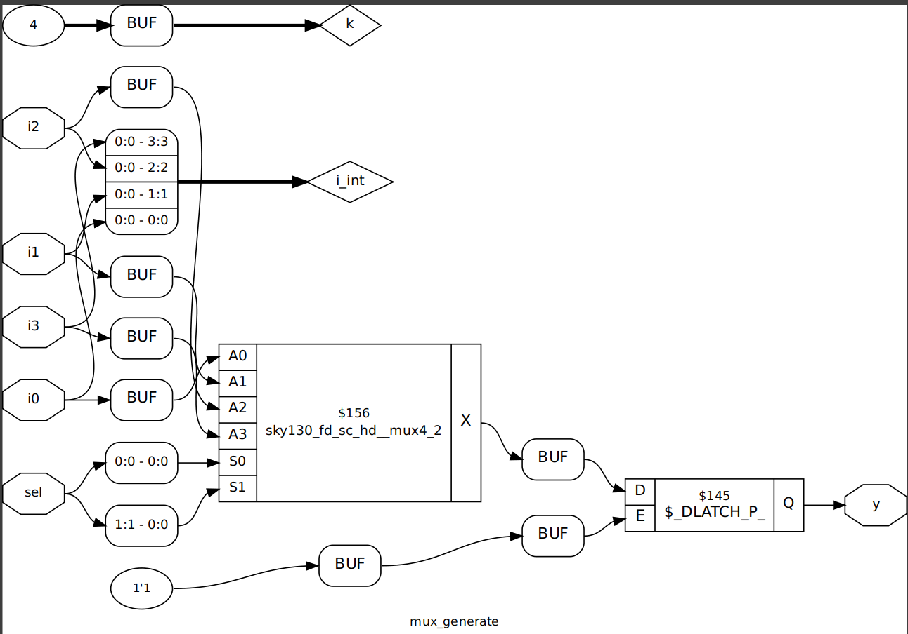

It is a 4x1 multiplexer behavior.   \

**CASE 2: demux using case statement.v**
```
module demux_case (output o0 , output o1, output o2 , output o3, output o4, output o5, output o6 , output o7 , input [2:0] sel  , input i);
reg [7:0]y_int;
assign {o7,o6,o5,o4,o3,o2,o1,o0} = y_int;
integer k;
always @ (*)
begin
y_int = 8'b0;
  case(sel)
    3'b000 : y_int[0] = i;
    3'b001 : y_int[1] = i;
    3'b010 : y_int[2] = i;
    3'b011 : y_int[3] = i;
    3'b100 : y_int[4] = i;
    3'b101 : y_int[5] = i;
    3'b110 : y_int[6] = i;
    3'b111 : y_int[7] = i;
  endcase
end
endmodule
```
All the outputs are initialised to 0, to avoid inferring laches. Depending on the select line, the input is allocated to one of the outputs.   \

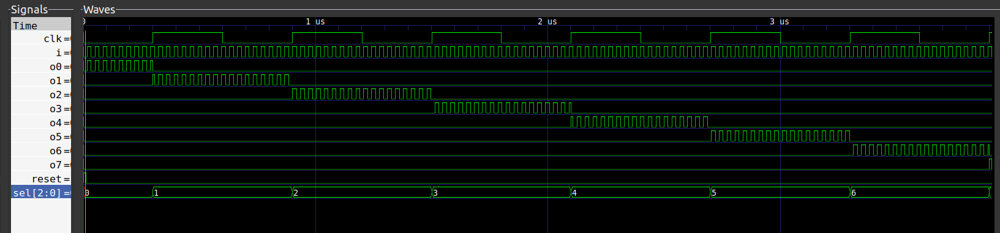 

It is a 1x8 multiplexer  \

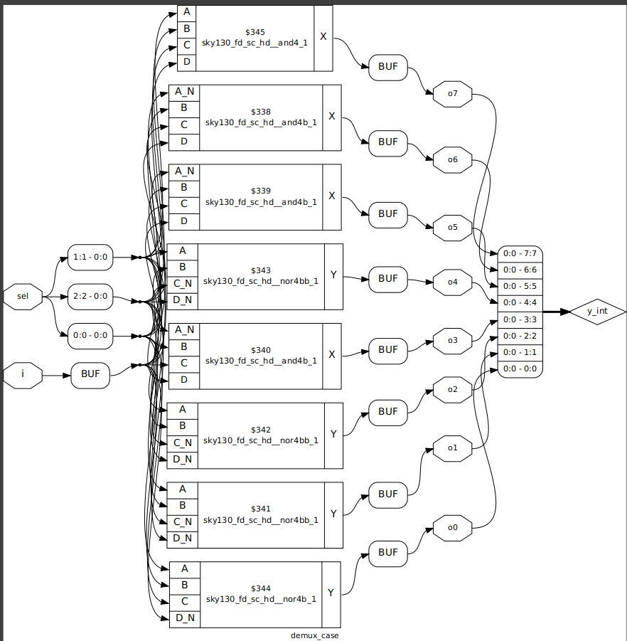 

It can be inferred that there is no Latch in the synthesized netlist as the case structure is complete (no presence of inferred latches).  \

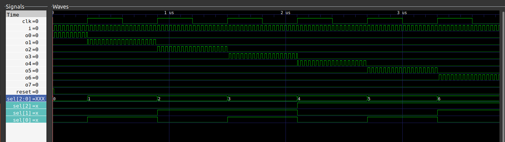 

The observed waveform in simulation and synthesis matches and conforms code functionality. \

**CASE 3: demux using generate if statement.v**
The experiment of using demux with generate if statement functions same as of demux with case statement. However, the advantage of using generate if statements is the number of lines in the code which almost remains the same even if the input lines in demultiplexer increases.
```
module demux_generate (output o0 , output o1, output o2 , output o3, output o4, output o5, output o6 , output o7 , input [2:0] sel  , input i);
reg [7:0]y_int;
assign {o7,o6,o5,o4,o3,o2,o1,o0} = y_int;
integer k;
always @ (*)
begin
y_int = 8'b0;
for(k = 0; k < 8; k++) begin
  if(k == sel)
    y_int[k] = i;
end
end
endmodule
```
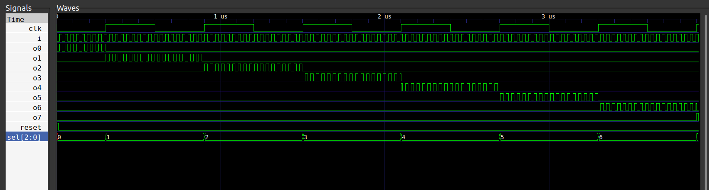 

 

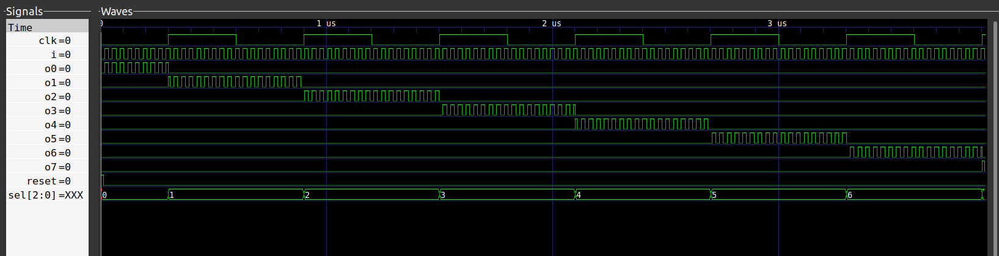 

The observed waveform in simulation and synthesis matches and conforms code functionality.  \

**CASE 4: Experiment on Ripple Carry Adder**
Instantiating the full adder in a loop to replicate the hardware. The output is always n+1 bits if both the inputs ate n bits. Since we are instantiating a full adder present in separate file, there is a need to tell the definition of full adder. It can also be seen that there is no always block used. The variable is genvar instead of integer.   \

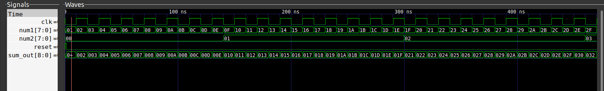

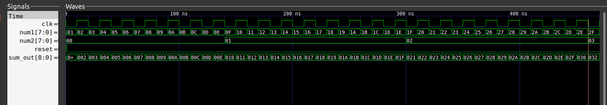

The observed waveform in simulation and synthesis matches and conforms code functionality.   \


## Acknowledgements

* Kunal Gosh, Co-Founder (VSD Corp. Pvt Ltd)
* Shon Taware, Teaching Assistant (VSD Corp. Pvt Ltd)


